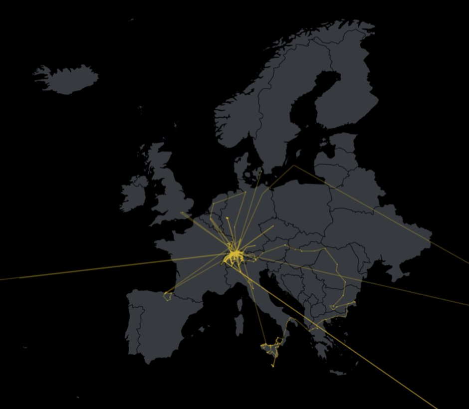

# Google-Maps-JSON-Visualization-with-R

## About
Based on a desire to visualize my geo recordings this project gathers a collection of R functions to load and display your recorded data from the google timeline. This is my first dive into project R. So everything is up to discussion and input.
All maps have been edited and modified with Mapshaper, QGIS and Geojson.io.



## Setup
0. Download your location history (Standortverlauf) as JSON file from https://takeout.google.com/settings/takeout
1. Set up working directory by dragging the project folder on to the R App.
2. Load source Files
	```
	source("Scripts/Install.R")
	source("Scripts/Places.R")
	```

3. Load your takeout data, by default a Demo.json file gets loaded. For Example
	```
    loadData("Data/Your-File.json")
	```
4. Draw a map like for example:
	```
    drawEuropeGeoMap()
	```
5. Display your data points like for example:
	```
    drawRecentPlaces()
	```

## Functions
*Documentation pending*

- drawLocalGeoMap (called by all swiss maps)
- drawZurichGeoMap
- drawBerneGeoMap
- drawSwissGeoMap

- drawEuropeGeoMap
- drawWorldGeoMap

- drawAllPlaces (may take some time…)
- drawSubsetPlaces (called by all other point functions)
- drawRecentPlaces
- drawMovingPlaces
- drawMostNorthernPoint
- drawMostSouthernPoint
- drawMostEasternPoint
- drawMostWesternPoint
- drawHighestPoint
- drawLowestPoint
- drawHighestVelocity
- drawWeekendPoints
- drawWorkdayPoints
- drawDaytimePoints
- drawDayPoints
- drawTimerangePoints
- drawTimerangeAltitudeChart


## Rescources
https://www.r-project.org/<br>
https://flowingdata.com/<br>
http://mapshaper.org/<br>
http://geojson.io/<br>
http://qgis.com/<br>
https://timogrossenbacher.ch/2016/12/beautiful-thematic-maps-with-ggplot2-only/<br>


## Thanks
Daniel Wiederkehr (Interactive Things)<br>
Timo Grossenbacher (SRF Data)<br>
And a ton of examples from stackoverflow.<br>


Have a nice day!<br>
Philipp Lehmann


